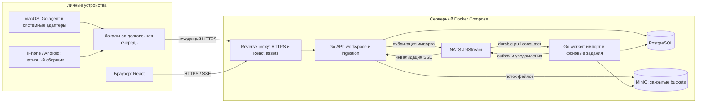

# Spotter: архитектура сервиса и интеграций с личными устройствами

Дата: 1 октября 2026 года. Статус: предлагаемое архитектурное решение для последующей разработки. Документ не подтверждает готовность кода, интеграций или развёртывания.

## 1. Решение и границы

Разделить Spotter на серверное приложение и доверенные сборщики на устройствах. Сервер — модульный монолит на Go с HTTP API и фоновым worker, React-интерфейсом, PostgreSQL, NATS JetStream и MinIO. Серверные компоненты запускаются в контейнерах как локально, так и на удалённом Linux-хосте. Сборщики работают в пользовательской сессии ноутбука или в мобильном приложении и сами устанавливают исходящие соединения с сервером.

Основной путь интеграции: **устройство → HTTPS Ingestion API → NATS JetStream → Go worker → PostgreSQL / MinIO**. NATS обеспечивает долговечную очередь и повторную обработку интеграционных событий. Устройства и браузер не получают доступ к внутреннему брокеру и БД. Интернет-доступ требует домена, HTTPS и аутентификации, но не изменения предметной модели.

Утверждённые пользователем ограничения: Go, React, PostgreSQL, NATS, MinIO, контейнеризация удалённой части, возможность интернет-доступа. Разбиение процессов, протоколы, сроки хранения и эксплуатационные параметры ниже — проектные рекомендации. Первый сценарий предполагает macOS и iPhone по текущей реализации; Android и другие ОС предусмотрены отдельными адаптерами. Один владелец и один workspace — начальный масштаб, совместная работа не входит в объём.

Требование Go применяется к серверу и ядру desktop-агента. Доступ к API мобильных ОС требует платформенного кода: Swift для iOS, Kotlin для Android. React остаётся веб-интерфейсом; браузерная версия не заменяет системные разрешения и нативный сборщик.

## 2. Исходное состояние и связь с требованиями

Основание: [README](../README.md), [каркас проекта](project-spec.md), [модель данных](data-model-spec.md), [состояние пользователя](wellbeing-spec.md), [правила Go](../golang-develop-rules.md) и перечисленные ниже файлы реализации.

| Область | Сейчас в репозитории | Целевое решение |
|---|---|---|
| Backend | `cmd/spotter`, `internal/app`, локальные сборщики в одном процессе | Общие доменные пакеты Go; отдельные роли API, worker, migrate и desktop-agent |
| Интерфейс | `web/app.js`, `web/workspace.js`, HTML/CSS/JS | React + TypeScript, общая карточка и общие команды всех экранов |
| Хранение | JSON состояния, отдельный workspace JSON, JSONL аудита | Транзакционный PostgreSQL; файлы в MinIO |
| macOS | AppleScript в `scripts/`, вызовы из `internal/collectors` | Перенос существующих адаптеров в нативный агент вне Docker |
| Здоровье | `internal/workspace/health.go`: чтение `health.json` из iCloud Drive, последний агрегат сна | Сохранить совместимый мост; затем мобильный импорт с историей и provenance |
| Сеть | В `internal/server/server.go` нет полноценной пользовательской аутентификации | Сессии пользователя, отдельная авторизация устройств, HTTPS |
| Контейнер | Текущий Dockerfile подменяет `osascript` заглушкой | Linux-контейнеры серверных ролей без обращения к macOS API |

Название текущего middleware `localOnly` не является защитой для публикации: код проверяет наличие RemoteAddr и отсутствие X-Forwarded-For, но не проверяет, что клиент — loopback. Нельзя просто выставить существующий порт в интернет или поставить перед ним proxy и считать целевую защиту реализованной.

Сохраняются инварианты целевой модели: идентичность TaskOccurrence, атомарные команды, workspace revision, неизменяемые снимки, история, неизвестное как null, явное происхождение измерений и независимость пользовательских решений от импорта. Решения R1–R13 из каркаса остаются открытыми: архитектура хранения не утверждает спорные формулы, лимиты и продуктовые политики.

В текущей модели данных есть условие «дневник и история остаются локальными». Для удалённого режима это необходимо явно уточнить: включённые пользователем категории сохраняются на его сервере; до включения не передаются. В локальном режиме данные остаются на локальном хосте. Исключение дневника и здоровья из LLM-входов сохраняется в обоих режимах. При реализации удалённого режима следует согласованно обновить это положение модели данных. Предметный транспорт определяется [спецификацией API](api-spec.md), база `/api/v2`. Её локальный профиль безопасности требует расширения для удалённого режима по разделу 10 настоящего документа; отсутствие Origin больше не разрешает неаутентифицированный CLI. Новые интеграционные маршруты ниже дополняют этот контракт и требуют включения в общую спецификацию до реализации.

## 3. Схема компонентов

Очередь на схеме логическая: каждое устройство имеет собственное хранилище. Граница доверия проходит на HTTPS API. Внутренняя сеть контейнеров также использует отдельные учётные данные и минимальные права.

### Серверные роли

| Роль | Ответственность |
|---|---|
| `edge` | TLS, лимиты запросов, статическая сборка React, маршрутизация API/SSE |
| `api` | Аутентификация, команды workspace, чтение представлений, проверка интеграционных пакетов, upload/download файлов |
| `worker` | Нормализация импорта, дедупликация, расписания, обработка outbox, опциональные выжимки |
| `migrate` | Однократное применение версионированных SQL-миграций перед запуском новой версии |
| `postgres` | Авторитетное состояние, история, receipt, outbox и задания |
| `nats` | JetStream для интеграций; краткоживущие уведомления об изменении состояния |
| `minio` | Содержимое файлов; их владельцы, статусы и связи — в PostgreSQL |

API, worker и migrate используют один версионированный образ приложения с разными командами запуска. Это роли одного приложения, а не независимые микросервисы с дублирующейся бизнес-логикой. Для первой установки достаточно одной реплики каждой долгоживущей роли.

Предлагаемые границы Go-пакетов: `workspace`, `sources`, `integrations`, `identity`, `files`, `wellbeing`, `planner`; инфраструктурные адаптеры — HTTP, PostgreSQL, NATS, S3. Правила не зависят от транспорта; интерфейсы вводятся на реальных границах ввода-вывода. Рабочие команды синхронно коммитятся в PostgreSQL, а не отправляются пользователем в очередь с неизвестным результатом.

## 4. Интеграции с ноутбуком и телефоном

### 4.1. macOS-агент

Нативный процесс Go запускается как LaunchAgent вошедшего пользователя. Его обязанности: выбор источников, сбор, нормализация минимальных полей, устойчивый локальный буфер, отправка и показ статуса синхронизации. Он не принимает входящие подключения из интернета и не открывает удалённое выполнение команд.

На первом этапе переиспользуются AppleScript-адаптеры Calendar, Reminders, Mail, Notes. Затем Calendar/Reminders можно перевести на небольшой подписанный helper с EventKit. Разрешения выдаются пользователем в macOS; Linux-контейнер не получает их через mount каталога. EventKit требует соответствующего доступа к календарю: [документация Apple](https://developer.apple.com/documentation/EventKit/accessing-calendar-using-eventkit-and-eventkitui).

Агент хранит секреты в Keychain, буфер в каталоге приложения с ограниченными правами и шифрованием чувствительных payload. Формат буфера может быть SQLite: это встроенный журнал доставки на устройстве, серверной БД остаётся PostgreSQL. Курсор чтения источника продвигается только вместе с долговечной записью данных в буфер. Сбой источника не заменяет его данные успешным пустым снимком.

### 4.2. Матрица источников

| Источник | Предпочтительный путь | Ограничения и запасной путь |
|---|---|---|
| Calendar / Reminders на Mac | Существующий AppleScript, позднее EventKit helper | Нужны локальные разрешения и доступная пользовательская сессия |
| Apple Notes | macOS-адаптер для выбранных папок | Не проектировать универсальное чтение базы Notes на iPhone; на телефоне — явная передача через Share Sheet/экспорт, если доступна выбранному формату |
| Mail на Mac | Существующий адаптер, минимальные метаданные | Не расширять автоматически до полной переписки и вложений |
| Apple Health | iOS companion с HealthKit | Согласие по типам данных; фоновый сбор зависит от ОС |
| Сон через текущий мост | Команда iPhone → `health.json` в iCloud Drive → macOS-агент → сервер | Нужны доступный Mac и синхронизация iCloud; это не прямой server-side доступ к HealthKit |
| Android health | Companion с Health Connect | Проверка доступности функций и выданных разрешений |
| Облачный календарь | Серверный адаптер официального API с OAuth | Опциональный этап; не зависит от включённого ноутбука |
| Файлы / другие заметки | Выбранная папка, ручной импорт или официальный API провайдера | Отдельный контракт каждого формата; произвольное приложение не становится доступным автоматически |

Один логический источник получает один авторитетный канал импорта. Например, один Google Calendar не подключается одновременно через Mac и cloud-adapter без явного объединения identity. Иначе появятся дубликаты встреч. Идентификатор устройства сам по себе не является идентификатором календаря или измерения.

### 4.3. iPhone и Android

Путь для полноценной автоматизации на iPhone — небольшое подписанное приложение Swift: запрос доступа к выбранным типам HealthKit, инкрементальное чтение, локальная очередь, отправка ограниченных пакетов HTTPS. Для календаря — отдельное разрешение EventKit. HealthKit использует гранулярную авторизацию; отсутствие доступных записей нельзя трактовать как нулевое значение или доказательство разрешённого чтения: [авторизация HealthKit](https://developer.apple.com/documentation/healthkit/authorizing-access-to-health-data).

Фоновая доставка требует capability/entitlement и не должна превращаться в обещание непрерывной синхронизации. Приложение также синхронизируется при открытии и по команде пользователя; интерфейс показывает время последнего получения и полноту периода. На iOS использовать системные фоновые механизмы, не постоянное NATS-соединение. См. [настройку HealthKit](https://developer.apple.com/documentation/Xcode/configuring-healthkit-access) и [background delivery](https://developer.apple.com/documentation/healthkit/hkhealthstore/enablebackgrounddelivery(for:frequency:withcompletion:)).

Android-адаптер следует тому же внешнему контракту, но использует Health Connect и платформенные задания. Фоновое чтение и расширенная история имеют отдельные ограничения/разрешения: [Health Connect read data](https://developer.android.com/health-and-fitness/health-connect/read-data). До реализации нужно проверить поддерживаемые версии реальных устройств и способ распространения companion-приложения.

Для первого работающего контура рекомендуется Mac + существующий импорт сна. Прямой iPhone → сервер устраняет зависимость от включённого Mac, но требует отдельной мобильной разработки. React/PWA покрывает просмотр и ручной ввод, не автоматическое чтение системного здоровья.

## 5. Протокол интеграционного обмена

### 5.1. Регистрация устройства

1. Владелец входит в веб-интерфейс и создаёт одноразовый код сопряжения с коротким сроком жизни.
2. Агент вводит код, получает собственную идентичность и ограниченные права для выбранных источников.
3. Код больше не используется. Устройство получает короткоживущий access token и ротируемый refresh credential; секрет хранится в системном защищённом хранилище.
4. В интерфейсе видны устройство, последнее соединение, источники, ошибки и кнопка отзыва. Сервер проверяет активность устройства при каждом приёме, worker — перед применением отложенного пакета.

Права устройства: отправить данные разрешённого source, загрузить разрешённый файл и прочитать собственные квитанции. Они не дают читать весь дневник, редактировать задачи или подключать другое устройство. Workspace и device берутся из проверенной авторизации, а не из доверия к JSON.

### 5.2. Предлагаемый HTTP-контракт

| Операция | Назначение |
|---|---|
| `POST /api/v2/device-enrollments` | Создать код сопряжения; только сессия владельца |
| `POST /api/v2/devices/enroll` | Обменять одноразовый код на credentials |
| `POST /api/v2/integrations/batches` | Принять ограниченный пакет событий; `Idempotency-Key` обязателен |
| `GET /api/v2/integrations/batches/{batchId}` | Получить собственную квитанцию и ошибки элементов |
| `POST /api/v2/files` | Авторизованная потоковая загрузка с лимитом размера и проверкой checksum |
| `GET /api/v2/files/{fileId}` | Авторизованная выдача закрытого объекта |
| `GET /api/v2/events` | SSE уведомления для браузера |

Рабочие команды задач, планов и дневника используют существующий целевой `POST /api/v2/workspace/commands`: `expectedRevision`, `operationId`, атомарный результат и конфликт 409. Здесь не задаётся новый конкурирующий набор продуктовых команд. Заголовок Idempotency-Key выше относится к новому integration API; в workspace сохраняется принятый operationId.

Конверт интеграционного события содержит `schemaVersion`, стабильный `eventId`, `batchId`, `sourceId`, `sourceEpoch`, `sequence`, `externalId`, `operation=upsert|delete`, `sourceVersion|null`, `observedAt`, `occurredAt|null`, `timezone|null`, `payload` либо `fileId`, `payloadHash`. Server-side добавляются `workspaceId`, `deviceId`, `receivedAt`, `traceId`. Sequence монотонен внутри одного источника/эпохи; переустановка или смена authoritative collector требует зарегистрированной новой эпохи и пересинхронизации.

Один пакет относится к одному источнику и укладывается в настроенный максимальный размер NATS-сообщения. Начальный проектный лимит — 256 KiB и 100 элементов, независимо от более широкого лимита брокера. Крупные данные сначала загружаются как файлы. Схема валидируется до публикации; неизвестная версия, неверные поля или чужой fileId отклоняют пакет целиком. Частичные бизнес-результаты после приёма отражаются по элементам в receipt.

### 5.3. Что означает подтверждение

API возвращает `202 Accepted` только после успешного JetStream PubAck. Это означает «пакет записан в брокер в рамках конфигурации его хранения», а не «данные уже применены». При недоступности брокера — 503; при лимитах — 429/503 с указанием повторить позже. Таймаут с неизвестным результатом обрабатывается повтором того же eventId/batchId.

До окончательной квитанции `applied`, `partially_applied` или `rejected` агент сохраняет исходный пакет. Сразу после 202 запрос статуса может ещё возвращать `pending/unknown`: receipt создаётся worker. Агент повторяет проверку, а при длительном отсутствии receipt повторяет отправку с тем же ключом. Нельзя интерпретировать это окно как потерю и генерировать новые ID.

Worker коммитит доменные изменения, идентификаторы обработанных событий и receipt в одной транзакции PostgreSQL, затем ACK сообщения. Падение после commit до ACK приводит к повтору; уникальный ключ `(workspace_id, source_id, event_id)` превращает его в возврат существующего результата. Повтор ключа с другим payloadHash — конфликт, а не молчаливая замена. Окно дедупликации JetStream помогает сократить повторы, но не заменяет уникальность в БД: [NATS deduplication](https://github.com/nats-io/nats.docs/blob/master/using-nats/jetstream/model_deep_dive.md).

Транспорт имеет семантику at-least-once; однократность бизнес-эффекта обеспечивается транзакцией и дедупликацией приложения. Квитанции/ключи дедупликации нельзя удалять раньше допустимого окна replay. Предлагается хранить компактные ключи весь срок существования источника, а payload — ограниченный срок.

## 6. NATS и устойчивость обработки

Использовать JetStream с файловым хранилищем и durable pull consumer, explicit ACK. Core NATS без JetStream не является долговечной входной очередью: [семантика JetStream](https://github.com/nats-io/nats.docs/blob/master/nats-concepts/jetstream/README.md).

| Назначение | Предлагаемый subject / политика |
|---|---|
| Импорт | `spotter.ingest.v1.<workspaceId>.<sourceId>`; stream `INGEST`, LimitsPolicy, FileStorage |
| Проблемные пакеты | `spotter.quarantine.v1.<workspaceId>`; отдельный долговечный stream, ограниченные доступ и срок хранения |
| Инвалидация UI | `spotter.changed.v1.<workspaceId>`; Core NATS, только ID/revision, потеря восстанавливается чтением API |

Subjects формирует сервер из безопасных непрозрачных ID; текст заметок, email и показатели здоровья туда не попадают. API может публиковать только ingest, worker — читать ingest и публиковать разрешённые результаты. Административные credentials не выдаются runtime-процессам.

Начальная настройка: INGEST до 7 суток с ограничениями байтов и числа сообщений, `DiscardNew` при переполнении, чтобы не вытеснять старые ожидающие данные ради новых. Это проектное окно буферизации, не гарантия бесконечного хранения. Ретрай с backoff и jitter; возраст очереди и оставшийся объём контролируются до истечения окна. На устройстве тоже задаётся квота; при её исчерпании сбор приостанавливается с видимой ошибкой, неподтверждённое не удаляется молча.

Временные ошибки БД повторяются. Невалидный доменный пакет получает terminal receipt с причинами. После ограниченного количества необъяснённых неудач пакет сохраняется в quarantine и фиксируется его статус; ACK исходного сообщения — только после долговечного сохранения результата. Quarantine использует тот же eventId для безопасного replay. У JetStream достижение MaxDeliver само по себе не переносит сообщение в DLQ: нужен обработчик/контроль advisory и зависших сообщений. См. [описание streams](https://github.com/nats-io/nats.docs/blob/master/nats-concepts/jetstream/streams.md).

Порядок применения не опирается на timestamps телефона. Для одного source worker сериализует применение через блокировку строки source в PostgreSQL; сравнивает эпоху, sequence и версии объектов. Старое событие не перезаписывает новое. Пропуск sequence помечает данные неполными и запускает reconciliation; инкрементальная цепочка с пропуском не объявляется полным снимком. Для параллелизма используются разные источники/workspace.

Изменение PostgreSQL и последующая публикация события выполняются через transactional outbox. Relay помечает запись отправленной после PubAck для долговечных сообщений; возможный повтор безопасен по eventId. Для UI достаточно best-effort уведомления: reconnect всегда сверяет revision с API. Outbox сохраняет согласованность доменных изменений с асинхронными последствиями без распределённой транзакции PostgreSQL–NATS.

## 7. Синхронизация и владение данными

По умолчанию интеграции только читают внешние системы. Импорт создаёт SourceItem/SourceCandidate, но не принимает обязательство за пользователя. Исходная заметка и созданная из неё задача — разные сущности. Изменение/удаление внешнего источника не удаляет принятую задачу, комментарии, ручные исправления и исторические снимки.

Ключ объекта — `(workspace, logicalSource, externalId)`; для повторяющегося календарного события дополнительно стабильный ключ конкретного occurrence. Сохраняются источник, revision/cursor провайдера, наблюдённое и серверное время. Если провайдер не имеет версии, адаптер задаёт порядок наблюдений и периодическую сверку; хеш содержимого помогает находить изменения, но не доказывает временной порядок.

Предусмотрены incremental upsert/delete и полный снимок с `snapshotId`, точной областью охвата, страницами и признаком завершения. Отсутствующие записи удаляются из текущей проекции только после получения всех частей успешного снимка и только внутри его области. Ограничение Mail последними N письмами или календаря временным окном не означает удаления остального. Отказ разрешения и ошибка чтения не являются пустым полным снимком.

Истёкший cursor означает новый полный сбор. Например, Google Calendar при невалидном sync token требует обработки 410 и повторной полной синхронизации: [официальный протокол](https://developers.google.com/workspace/calendar/api/guides/sync). Серверный cloud-adapter тоже проходит общий ingress/JetStream-контракт и не создаёт второй путь записи предметных данных.

Для здоровья сохраняются единица, исходный тип, период, origin provider/device, external sample ID и полнота. Перекрывающиеся интервалы сна объединяются по согласованной формуле; одно измерение с телефона и часов не суммируется дважды. Ручной выбор/коррекция хранится отдельно от исходного значения, импорт не снимает подтверждение молча. В первой версии передаются выбранные агрегаты, сырые health samples по умолчанию остаются на устройстве. Формула агрегата и её версия обязательны: суточное окно существующего sleep-моста не выдается за ночной сон по другой методике.

Удаление внешнего объекта, отключение интеграции и запрос удалить сохранённые персональные данные — три разные операции. При удалении категории сервер сначала отзывает право новых импортов, блокирует применение старой очереди по поколению consent/source, затем очищает соответствующие payload, файлы и проекции. Остаётся только необходимый технический маркер запрета повторного применения без личного содержимого. Повторное подключение требует новой эпохи и явного выбора импортируемой истории.

## 8. PostgreSQL и MinIO

### 8.1. PostgreSQL

Логическая модель из `data-model-spec.md` переносится в нормализованные таблицы без изменения её смысла. Основные группы: projects/events, task definitions/occurrences/events, recurrence rules, plans/items/snapshots, sessions/intervals/time entries, source items/candidates, wellbeing records/measurements. Добавляются identity/devices/source connections, sync cursors, import receipts/processed events, files, outbox, migration manifests и coverage.

В начальном single-user deployment один workspace. Владение фиксируется на уровне схемы; ссылки проверяют тот же workspace. Пользовательская авторизация не смешивается с `completionActor`. FK, уникальные индексы и транзакции защищают инварианты; для общего revision используется условное обновление/блокировка строки workspace. Импорт, меняющий workspace (например, измерения дневника), следует тому же протоколу revision, что и команды пользователя. Обновление только внешнего снимка изменяет sourceSnapshotId, а не workspaceRevision, согласно API; принятие кандидата атомарно проверяет candidateVersion.

Команда сохранения карточки/закрытия дня атомарно меняет состояние, историю, revision, idempotency receipt и outbox. 409 сохраняет черновик клиента. Неизменяемые снимки содержат поля на момент фиксации, не только ссылки на живые задачи. JSONB подходит для входного payload и снимков; отношения и важные ограничения не прячутся в один произвольный JSON.

Для предусмотренных API readToken сервер материализует неизменяемый согласованный срез в PostgreSQL с expiresAt и очисткой по TTL. Нельзя держать PostgreSQL-транзакцию открытой между HTTP-страницами или читать каждую страницу из нового состояния под прежним токеном. Для первого масштаба снимки в PG проще отдельного cache-сервиса; нагрузка и объём ограничиваются опубликованным профилем API.

UTC `timestamptz`, IANA timezone и локальная дата хранятся раздельно по смыслу. Неизвестные исторические факты не заполняются временем миграции. Миграции применяются отдельной ролью; runtime не имеет DDL-прав. Архитектура использует журнал бизнес-событий, но не требует полного event sourcing и восстановления всего состояния из NATS.

### 8.2. MinIO

MinIO хранит вложения, явно загруженные файлы и согласованные импортные архивы; PostgreSQL — `fileId`, workspace, объектный ключ, размер, SHA-256, MIME, состояние, назначение и ссылки. Bucket закрыт. Root-ключи MinIO отсутствуют в API/worker; каждому сервису выдаются ограниченные права.

Первый вариант передачи — потоковая прокси-загрузка/скачивание через Go API с лимитами времени и размера. MinIO не публикуется в интернет. Позже допустимы короткоживущие presigned URL с отдельным HTTPS endpoint, CORS и проверкой завершения; подпись объекта не заменяет авторизацию выдачи URL.

Согласованность БД и объекта обеспечивается состояниями `pending → ready → deleting/deleted`, без предположения об общей ACID-транзакции. Upload создаёт pending metadata, пишет объект под уникальным ключом, проверяет размер/checksum и переводит запись в ready. Событие может ссылаться только на готовый объект своего workspace. Сбой оставляет очищаемый orphan/pending; фоновая сверка удаляет его после периода ожидания. Удаление запускается через outbox с повтором. Готовые объекты неизменяемы; обновление файла создаёт новый объект.

**Уточнение выбора дистрибутива:** при проверке 1 октября 2026 года официальный community-репозиторий MinIO отмечен как архивный и больше не поддерживаемый; README указывает source-only distribution. MinIO сохраняется в требуемом стеке, но перед эксплуатацией необходимо выбрать поддерживаемый вариант поставки либо взять сопровождение сборки на себя. Зафиксировать происхождение исходников/образа и digest, не полагаться на `latest`. Это реальное ограничение сопровождения, а не выполненный выбор лицензии или замена технологии: [официальный репозиторий MinIO](https://github.com/minio/minio). Домен зависит от интерфейса S3, чтобы замена поставки не потребовала менять данные задач.

## 9. React и пользовательские API

Одна React + TypeScript SPA содержит шесть разделов существующего ТЗ. Статическая production-сборка раздаётся edge; Node нужен на стадии сборки, отдельный Node runtime на сервере не требуется. Общий редактор задачи, query cache, контракты ошибок и инвалидирование исключают расхождения между экранами. Машиночитаемый OpenAPI на основе существующей спецификации API и JSON Schema для интеграционных событий следует подготовить до реализации клиентов.

Сервер владеет бизнес-правилами, версиями, временем фактических операций и формулами. Клиент владеет черновиками и состоянием отображения. Отправка команды включает ключ идемпотентности и исходную revision. При конфликте показываются актуальная версия и сохранённый черновик; автоматического last-write-wins нет.

SSE сохраняет контракт API v2: событие сообщает `revision` и `domains`, handshake/reset также позволяет сверить `sourceSnapshotId`; после уведомления React перечитывает данные. На reconnect проверяются обе версии; если история уведомлений утрачена, выполняется полный refetch. Наличие SSE-соединения не означает актуальность источника: отдельно показываются `lastCollectedAt`, `lastReceivedAt`, `lastAppliedAt`, coverage и ошибки.

Полный офлайн-редактор с автоматическим слиянием не входит в первую версию. При недоступном API изменения не показываются как сохранённые; чувствительные данные не складываются в persistent browser cache по умолчанию. Долговечная офлайн-очередь обязательна для сборщиков, но это другой контракт.

## 10. Интернет-доступ и персональные данные

Для single-user сервера предлагается вход через OIDC Authorization Code с PKCE и allowlist одного subject. Go выступает BFF: хранит серверную сессию, выдаёт Secure/HttpOnly/SameSite cookie; provider tokens не хранятся в localStorage. Провайдер может быть внешний или self-hosted отдельным контейнерным профилем. При требовании работы полностью без интернета нужен локальный IdP и заранее проверенный вход без внешних зависимостей. Конкретный IdP — решение перед реализацией identity-модуля.

Публичной регистрации нет. Сессия браузера и credentials устройств разделены. Отзыв сессий, устройств и интеграций выполняется независимо. На изменяющих browser-запросах — CSRF-защита и проверка Origin; CORS разрешает только настроенный origin. Reverse proxy очищает клиентские forwarded headers, API доверяет только известному proxy. Базовый URL задаётся конфигурацией, а не произвольным Host запроса.

TLS нужен с телефона и при локальном сетевом доступе. Публичный сервер открывает только 443; 80 допустим для redirect/выпуска сертификата. PostgreSQL, NATS, MinIO API/console и диагностические endpoints не публикуются. Доступ администратора — через закрытый канал. Лимиты пакетов, квоты по устройству/источнику, таймауты и rate limiting защищают ресурсы и очередь.

Категории синхронизации включаются явно: календарь, выбранные папки заметок, почтовые метаданные, выбранные показатели здоровья. Журналы содержат ID, коды и длительности; заголовки заметок, payload, токены и полный prompt не печатаются. Текущий подробный JSONL-аудит модельных запросов нельзя механически переносить в удалённый централизованный лог.

Шифрование трафика и дисков/резервных копий обязательно для удалённой установки с персональными данными. Секреты монтируются отдельно от образов и Git. Сервер получает выбранные данные в открытом виде для вычислений: это не end-to-end encryption от администратора хоста. Если серверу нельзя доверять содержимое, потребуется другой режим с вычислениями на устройстве и существенно ограниченным сервером.

Начальная политика хранения, подлежащая согласованию: нормализованная история — до удаления владельцем; входной payload и quarantine — до 7 суток; технический аудит — 30 суток; неподтверждённый буфер устройства — до терминального результата с квотой. В архивы не включаются сырые health samples по умолчанию. Удалённые данные могут оставаться в резервных копиях до окончания их срока хранения; восстановление должно повторно применить журнал удаления/отзыва до открытия доступа.

LLM — опциональный модуль worker, отказ которого не блокирует рабочие операции. Он получает только явно разрешённые сведения выбранных источников. Здоровье, дневник, пользовательские решения и история работы не передаются автоматически. Для локальной модели на ноутбуке не открывается Ollama-порт в интернет: допустим отдельный opt-in агент обработки, получающий ограниченные задания по исходящему соединению. Это расширение, не требование первого этапа.

## 11. Контейнерное развёртывание

| Режим | Топология | Особенности |
|---|---|---|
| Локально на Mac | Вся серверная часть в Docker Compose; macOS-агент нативно | Для браузера publish на loopback; телефон требует отдельного LAN/VPN-доступа и доверенного TLS |
| Один удалённый сервер | Тот же Compose на Linux, domain + edge TLS | Агенты используют публичный BASE_URL, работают из NAT/мобильной сети исходящим HTTPS |
| Рост / высокая доступность | Несколько API/worker, вынесенные отказоустойчивые PG/JetStream/S3 | Отдельный этап по измеренной нагрузке и требованиям к доступности |

Телефон не может подключиться к `localhost` ноутбука. Для локального пилота с телефоном используется LAN-адрес/локальное имя или VPN; ноутбук должен быть доступен. Когда ноутбук спит, сервер на нём тоже недоступен, пакет остаётся на телефоне. Удалённый сервер доступен независимо от ноутбука, но свежие данные из Apple Notes на Mac всё равно ждут пробуждения агента.

Будущие артефакты развёртывания: базовый Compose, локальный и серверный overrides, `.env.example` без секретов, versioned images/digests, healthchecks и руководство backup/restore. В рамках этого документа они не создаются. Все постоянные данные PostgreSQL, JetStream и MinIO размещаются в отдельных durable volumes; пересоздание контейнера их не удаляет.

Runtime работает без root, без Docker socket и лишних capabilities; filesystem read-only там, где возможно. Приложение поддерживает amd64 и arm64, graceful shutdown и ограниченные ресурсы. API/worker самостоятельно повторяют соединения: порядок старта Compose и healthcheck не заменяют обработку отказов.

Отдельные `/livez` и `/readyz`: liveness проверяет процесс; готовность записей проверяет необходимые зависимости. Недоступность NATS останавливает ingress с 503, но не чтение и команды workspace при рабочем PostgreSQL. Отказ MinIO затрагивает файлы, а не весь сервис. Общий readiness не должен убирать API из маршрутизации только из-за опционального LLM.

Для небольшой установки стартовая оценка — 2–4 vCPU, 4–8 GiB RAM и SSD с резервом на очереди и backup staging, без локальной LLM. Это бюджет для проверки, не измеренная ёмкость. Однохостовый Compose имеет единую точку отказа; несколько контейнеров на одном диске не обеспечивают HA. Переход к JetStream replication требует независимых узлов, PostgreSQL — отдельно настроенных репликации/переключения.

## 12. Эксплуатация, восстановление и отказные сценарии

Нужны структурированные логи с operationId/eventId, метрики backlog, oldest unprocessed age, outbox age, device freshness, retries/quarantine, HTTP latency/errors, свободного диска и результатов backup. В метриках нет текстов и медицинских значений. Пользователь видит деградацию конкретного источника и дату последнего успешного применения.

| Сбой | Ожидаемое поведение |
|---|---|
| Устройство офлайн | Локальный буфер, повтор с теми же ID; сервер показывает устаревание |
| API потерял ответ после PubAck | Безопасный повтор, один бизнес-эффект |
| Worker упал после commit до ACK | Повтор получает сохранённый receipt |
| NATS недоступен / очередь полна | Ingress возвращает ошибку; агент не удаляет буфер; рабочие команды продолжаются через PG |
| PostgreSQL недоступен | Worker не ACK; API не сообщает успешное сохранение |
| MinIO недоступен | Ошибка только файлового шага, pending metadata и безопасный повтор |
| Источник отозвал разрешение | Ошибка/unknown, без удаления данных как «пустого снимка» |
| Истекло хранение сообщения | Агент с незавершённым receipt повторяет пакет; полная сверка восстанавливает доступные записи |
| Устройство отозвано | Новый ingress запрещён, отложенные пакеты не применяются без действующего consent |

Backup — вне основного хоста: PostgreSQL backup с WAL для PITR при соответствующем RPO, копия версий/объектов MinIO, JetStream snapshot для принятых необработанных событий, конфигурация и необходимые ключи в отдельном защищённом хранилище. Persistent volume сам по себе резервной копией не является.

Для первой версии предлагаются целевые RPO до 24 часов и RTO до 4 часов; это цели, которые нужно подтвердить восстановлением. При необходимости меньшего RPO нужны более частые копии/WAL и соответствующее объектное хранение. Успешный PubAck на одиночном сервере не гарантирует сохранность при потере диска.

Простой согласованный backup для первого single-user режима: приостановить входящие записи и worker, дождаться завершения транзакций/uploads, зафиксировать manifest с версиями/временем/checksum, скопировать PG, объекты и JetStream, возобновить работу. Для online backup отдельно спроектировать согласование точки PostgreSQL с версиями объектов и диапазоном replay очереди. Нельзя независимо восстановить PG «на вчера», удалить очередь и обещать отсутствие потерь уже ACK-нутого импорта.

Порядок восстановления: закрытый контур → секреты/схема совместимой версии → PG и объекты → проверка ссылок/checksum → очередь и replay с дедупликацией → применение запретов/удалений → проверка owner login и контрольных данных → открытие ingress. После восстановления возможен сбор актуального снимка с устройств, но это не восстанавливает исчезнувшую у источника историю.

## 13. Переход от текущей реализации

1. **Уточнить контракты.** Согласовать источники/ОС, категории удалённого хранения, identity и поставку MinIO; подготовить HTTP/event schemas. Не закрывать R1–R13 архитектурным решением.
2. **Выделить сборщик.** Перенести macOS collection в отдельный агент, сохранить чтение текущего sleep-файла. Проверить устойчивый буфер и доставку при перезапусках.
3. **Подготовить серверное ядро.** PostgreSQL-репозитории, транзакции workspace, auth, ingestion, JetStream worker/outbox и файловый контур. Локальный Compose должен использовать те же пути обработки, что удалённый.
4. **Мигрировать данные.** Снять копии state/workspace JSON; импортировать в пустую схему с MigrationManifest, checksum, исходными ID и coverage. Старые строковые проекты преобразовать через явную таблицу соответствия, не выдумывать дерево и историю. Старый последний агрегат сна не превращать в полный дневник измерений.
5. **Перевести интерфейс на React.** Подключить шесть представлений к общей модели и единому редактору, сохранить конфликтующие черновики, проверить сквозные инварианты.
6. **Проверить локальный пилот.** Mac, sleep-мост, файлы, перезапуски, отзыв доступа, backup/restore. При переключении остановить запись старой версии; не запускать два независимых авторитетных хранилища.
7. **Включить удалённый режим.** Тот же стек с domain/TLS/auth, закрытыми сервисными портами, резервным копированием и проверкой с внешней сети. Только после этого менять endpoint агентов.
8. **Расширить мобильные интеграции.** Нативный HealthKit/Health Connect, затем cloud-adapters и при необходимости двусторонние операции как отдельный контракт конфликтов/подтверждений.

Откат до открытия новой системы на запись — восстановление исходных файлов и предыдущей версии. После новых записей откат требует отдельного экспорта/обратной миграции; простое возвращение старого JSON потеряет изменения. Исходные файлы не удаляются до проверки импорта и согласованного срока хранения.

## 14. Критерии проверки будущей реализации

Документ считается реализованным только после подтверждения следующих сценариев; сейчас это план проверок, а не результаты тестов:

- Локальный и удалённый профили запускают один набор версионированных серверных образов; удалённый сервер не зависит от macOS runtime.
- Агент за NAT и телефон вне домашней сети доставляют данные по HTTPS; открывать порты на устройствах не требуется.
- Повтор пакета, разрыв после PubAck и падение после commit не создают дубликатов задач/измерений/файлов.
- Переставленные события, неполный snapshot и истёкший cursor не уничтожают актуальные данные.
- Чужое/отозванное устройство не читает workspace и не применяет новые или уже поставленные в очередь данные запрещённой категории.
- Параллельные пользовательские команды и импорт сохраняют revision, атомарность снимков и единственный фокус согласно модели.
- Импорт не затирает пользовательский черновик, принятую задачу или ручную коррекцию здоровья.
- Отказы NATS, PG и MinIO дают описанную деградацию; переполнение диска/буфера заметно до потери окна доставки.
- Фактическое поведение фонового HealthKit/Health Connect проверено на выбранных физических устройствах, включая отзыв разрешений и длительный офлайн.
- Проверены единицы, timezone/DST, повторяющиеся встречи и перекрывающиеся интервалы сна; неизвестное не превращается в ноль.
- Из отдельной резервной копии восстановлены связные PG/MinIO/JetStream, проверены контрольные записи и отсутствие повторного применения удалённых данных.
- Отдельно подтверждены отсутствие персональных payload в логах и исключение здоровья/дневника из запросов модели.

## 15. Решения, которые нужны перед соответствующим этапом

| Вопрос | Рабочее предположение документа | Что зависит от ответа |
|---|---|---|
| Какие устройства используются? | macOS + iPhone; Android позже | Платформенные адаптеры, способ установки и проверки |
| Какие календарь и заметки являются источником истины? | Apple Calendar/Notes через Mac | Identity источников, OAuth/cloud-адаптеры и дедупликация |
| Какие данные разрешено хранить удалённо? | Только явно включённые категории; health — агрегаты | Consent, retention, изменения условия локальности в модели |
| Нужна ли полностью автономная работа без интернета? | Локальная серверная часть возможна; identity выбирается отдельно | Локальный IdP и сетевой режим телефона |
| Как поставлять и сопровождать MinIO? | Требование технологии сохранено, дистрибутив не выбран | Образ, обновления, эксплуатационная ответственность |
| Какая допустима потеря и длительность простоя? | Проектные RPO 24 ч / RTO 4 ч | Частота backup, WAL, необходимость нескольких узлов |
| Нужна ли запись обратно в Calendar/Notes/Health? | Только чтение и явный экспорт | Отдельные права, конфликты и подтверждения внешних изменений |

Эти вопросы не мешают зафиксировать архитектурное разделение. Они должны быть закрыты перед реализацией соответствующего модуля; контейнеризация и переход на удалённый хост не снимают ограничений API личных устройств.
