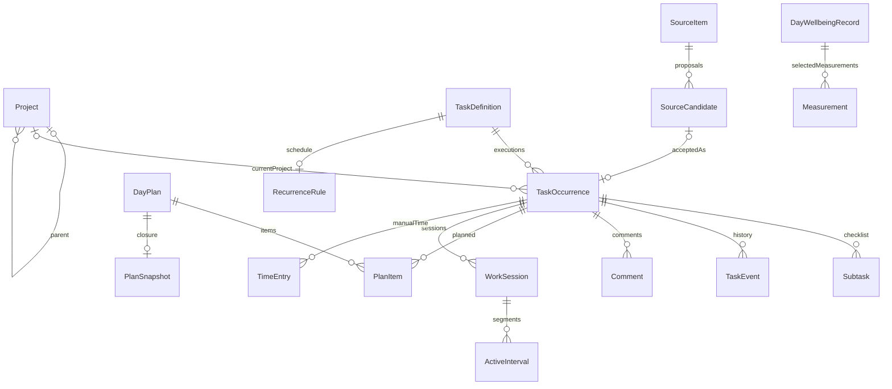

# Спецификация модели данных Personal Spotter

Дата: 1 октября 2026 года. Версия документа: 1. Статус: целевая модель для разработки; программная реализация и миграция не выполнялись.

## 1. Область и приоритет

Модель покрывает [Inbox](inbox-spec.md), [карточку](task-card-spec.md), [рабочий день](workday-spec.md), [проекты](projects-spec.md), [статистику](statistics-spec.md) и [дневник состояния](wellbeing-spec.md). Межраздельный источник требований — [каркас проекта](project-spec.md). Контракт транспорта описывается отдельно в [спецификации API](api-spec.md).

При расхождении с существующими структурами Go и старым поведением приоритет имеет настоящая целевая модель. Макеты не являются схемой хранения. Новая модель не превращает решения `proposal` из R1–R13 в утверждённые продуктовые правила: ниже отделены обязательные данные от выбираемой политики. До выбора политики спорный показатель возвращается как недоступный с причиной либо как явно обозначенный предварительный расчёт; молчаливый выбор запрещён.

Исходная реализация: [AppState](../internal/model/model.go), [workspace](../internal/workspace/workspace.go), [сон](../internal/workspace/health.go), [HTTP workspace](../internal/server/workspace.go). Сейчас `AppState` — заменяемый снимок источников и модельных выжимок; `workspace.Data` — отдельный JSON с задачами, общей версией, настройками, последним обзором и последним агрегатом сна. `Task.Project` — текст, `Status` смешивает Inbox и работу, `MITDate/MainDate` допускают одну дату, `Minutes` обязателен и ограничен 15–480. История, дерево, измеренные сессии и идемпотентные квитанции в этих структурах отсутствуют. `Data.Version` — версия изменений, не версия схемы.

## 2. Общие типы и хранение

Это логическая схема, не требование перейти на определённую СУБД. Реализация может использовать транзакционную БД либо единый атомарно заменяемый документ. Разнесение связанных изменений по независимо сохраняемым JSON-файлам без транзакционного журнала не удовлетворяет атомарности.

| Тип / поле | Контракт |
|---|---|
| `ID` | Непустая непрозрачная строка, стабильна после создания; старые ID сохраняются. Новые генерирует сервер; название и дата не являются ID |
| `schemaVersion` | Целое, версия структуры хранилища; отдельно от `revision` |
| `revision` | Монотонная версия workspace, увеличивается один раз на успешную изменяющую транзакцию |
| `entityVersion` | Версия изменяемой сущности; для первого API достаточно общей `revision`, версии сущностей служат детализации конфликтов |
| `Instant` | Абсолютное время RFC3339 с offset; хранение нормализовано в UTC, исходный IANA-пояс сохраняется отдельно |
| `LocalDate`, `LocalTime` | `YYYY-MM-DD`, `HH:mm[:ss]`; реальная календарная дата, не строковое приближение |
| Неизвестное | `null`, а не 0, пустая дата или время миграции. Пустой список — известное отсутствие записей; полнота истории описывается отдельно |
| Длительности | Общая оценка и объём дня — целые положительные минуты либо null; остаток — целые неотрицательные минуты либо null; факт — целые неотрицательные миллисекунды. Округление только при показе |
| Общие метаданные | `id`, `createdAt`, `updatedAt`, `entityVersion`; неизвестный исходный `createdAt` при миграции допускает null и `importedAt` |

Workspace однопользовательский. `completionActor` не является учётной записью или системой назначения исполнителей. Дневник и история остаются локальными, не включаются в LLM-входы. Технический аудит содержит ID, коды и длительности без текстов задач/дневника; существующий подробный аудит модельных запросов — отдельный контур.

Обязательны `HistoryCoverage` (по домену: `knownFrom`, пробелы интервалов, `reason`, `baselineAt`), `MigrationManifest` (исходная версия, контрольные суммы, отображение ID, время, предупреждения) и архив исходных данных для обратимости. Наличие текущего состояния не доказывает прошлую историю.

## 3. Сущности и связи

`TaskOccurrence.id` — общий taskId всех экранов. Для разовой задачи создаются definition и ровно одно выполнение; definition хранит происхождение/идентичность, но не второй набор редактируемых полей разовой карточки. Для регулярной definition содержит шаблон будущих выполнений. Конкретная карточка всегда редактирует occurrence; изменение шаблона — отдельная явная операция. ID definition и occurrence различны; старый taskId становится ID occurrence.

### 3.1. Проекты

`Project`: `id`, `parentId: ID|null`, `name`, `position`, общие метаданные. `parentId=null` — корень. «Без проекта» представляется `projectId=null`, а не фиктивным проектом. Ветка содержит и задачи, и дочерние проекты. FK должны существовать; циклы и ссылка на себя запрещены. Перенос/переименование сохраняют ID. Удаление ветвей с содержимым не входит в первую версию; исторически используемые ссылки физически не удалять.

`ProjectEvent`: `id`, `projectId`, `sequence`, `occurredAt`, `kind`, `before/after` для name/parentId, `operationId`. Сохранять историю дерева даже пока политика R3 не выбрана. Перенос задачи записывается в её TaskEvent, не переписывает старые события. Политика одинаковых соседних имён и максимальная глубина — R13; поддержка минимум трёх уровней обязательна.

### 3.2. Определение, выполнение, карточка

`TaskDefinition`: `id`, `kind=one_off|recurring`, `sourceCandidateId|null`, `template|null`, `templateVersion`, метаданные. Template регулярной задачи содержит значения полей карточки для будущего выполнения и шаблон подпунктов, но не состояние работы, факт времени, комментарии, фокус и членство в плане.

`TaskOccurrence`:

| Поле | Тип / смысл |
|---|---|
| `id`, `definitionId` | Общий taskId и FK определения |
| `recurrenceRuleId`, `slotKey`, `templateVersion` | null у разовой; у регулярной идентичность периода и версия шаблона |
| `title`, `description`, `resume` | Непустое название, отдельные текст описания и заметка продолжения |
| `projectId` | FK либо null |
| `context` | `computer\|away\|anywhere`, default anywhere |
| `importance`, `urgency` | `unknown\|yes\|no`, default unknown; независимы |
| `priorityNote` | Необязательное пояснение |
| `reviewRequired`, `reviewReason` | bool; `new\|plan_closed\|manual\|scheduled\|null` |
| `lifecycleState` | `not_started\|in_progress\|waiting\|done` |
| `workMode` | `active\|paused\|background` только при in_progress; иначе null |
| `multiDay` | bool, явное распределение между днями; default false, не выводится из оценки |
| `complexity` | `easy\|medium\|hard`, default medium для текущей карточки |
| `estimateMinutes`, `remainingMinutes` | Общая оценка int ≥1 либо null; остаток int ≥0 либо null. Нулевой остаток не завершает задачу |
| `waitingOn`, `backgroundReason`, `checkAt` | Отдельные поля текущего ожидания/фона; checkAt — null либо `{kind:date,date,zone}` / `{kind:instant,at,zone}` |
| `deadline` | null либо `{kind:date,date,zone}` / `{kind:instant,at,zone}` |
| `scheduled` | null, `{kind:"date_range",startDate,endDate:null\|Date,zone}` или `{kind:"timed",startAt,endAt:null\|Instant,zone,localStart?,localEnd?,offsetChoice?}`; старый объект без kind принимается как timed |
| `relatedTaskIds` | Массив ID явно связанных задач; двусторонний, без повторов и ссылки на себя; обе стороны обновляются атомарно |
| `inboxAvailableAt` | Instant\|null; отдельный момент появления, не дедлайн |
| `completionEventId` | FK последнего действительного завершения либо null |
| `migrationBaselineId` | ID импортного baseline либо null; позволяет отличить legacy done без события завершения |
| `legacy` | Сохранённые несовместимые поля и происхождение миграции; не активная бизнес-логика |

Категория длительности — проекция: multiDay=true означает многодневную; иначе известная оценка ≤25 минут короткая, >25 — длительная. При неизвестной оценке показывается «Нужна оценка».

Все новые задачи: not_started, workMode=null, reviewRequired=true; завершение допускается непосредственно из not_started. Активный Inbox включает только доступные по времени, незавершённые occurrences. Неразобранное: reviewRequired либо одна ось unknown. Матрица: обе оси определены и reviewRequired=false. Завершённые доступны в истории. Редактирование описания не снимает reviewRequired; действие разбора меняет этот признак явно. Приоритет не добавляет задачу в план.

Ожидание требует причины и контрольной даты/момента; фон — причины и проверки. На выходе текущий контроль очищается, прежние значения остаются событием. Пауза допускает пустую заметку. Текстовое представление «На паузе» — in_progress+paused; «В фоне» — in_progress+background. Фокус и таймер отдельно.

`Subtask`: `id`, `occurrenceId`, `title`, `position`, `done`, `completedAt|null`. Уникальность `(occurrenceId,id)`; стабильный порядок; новые выполнения получают новые ID подпунктов. Это чек-лист, без собственного проекта, времени и единицы статистического результата. Завершение с незакрытыми пунктами требует `unfinishedSubtasksDecision=keep_open|complete_all`; без решения отказ. Решение и изменения входят в ту же транзакцию.

`Comment`: `id`, `occurrenceId`, `text`, `createdAt`, `operationId`. Первая документируемая политика R11 — добавление; редактирование/удаление сохранённых комментариев не подразумевается. Черновые комментарии не существуют вне черновика до сохранения карточки.

### 3.3. История и завершение

`TaskEvent`: `id`, `occurrenceId`, `sequence` (глобальный порядок транзакций и событий), `occurredAt`, `recordedAt`, `zone`, `type`, `payload`, `operationId`, `schemaVersion`. `occurredAt` обычной команды назначает сервер. Импорт старого состояния — `migration_baseline`, не фиктивное событие создания/завершения. Существенные изменения записывают before/after: состояние, проект, приоритет/разбор, оценки, сложность, сроки, расписание, подзадачи, заметку, включение в план и выбор главного результата. Технический refresh источника не считается личной активностью.

Событие `completed` содержит `completionActor=self|other|unknown`, `complexityAtCompletion` (null только для неизвестной истории), `projectIdAtCompletion`, `completionDate`, `zone`, `outsidePlan`, `matchingPlanIds`, решение по подпунктам. `outsidePlan` фиксируется из сохранённых членств в планах этой даты, существовавших до завершения; добавление позже его не меняет. Ручное время ссылается на TimeEntry, не хранится как длительность «завершения». Unknown actor не увеличивает личную активность; новый UI предлагает явный выбор, миграция никогда не назначает self автоматически.

`reopened` ссылается на отменяемое completionEventId и очищает текущую ссылку, сохраняет факт времени и prior triage/priority. Повторное открытие по умолчанию даёт not_started, workMode=null, без фокуса и таймера; восстановление иного режима требует отдельного явного действия. Для legacy done без completionEventId повторное открытие ссылается на migrationBaselineId и записывает reopened_from_baseline: неизвестное старое завершение не создаётся. Закрытый план не открывается. Исторические события неизменяемы. Коррекция при разрешении R11 добавляет событие с `supersedesEventId`, причиной и авторством local_user; цикл исправлений запрещён. Проекции не изменяют исходные факты.

### 3.4. Источники и предложения

`SourceConnection`: `id`, `kind=calendar|reminders|mail|notes|health_bridge`, `accountScope|null`, ограничения окна/папки/лимита; `SourceSyncState`: connectionId, `attemptAt`, `lastSuccessAt|null`, `status=ok|failed|unavailable`, errorCode, snapshotId, coverage. Успешная пустая выборка имеет status=ok и count=0.

`SourceItem`: `id`, `connectionId`, `externalId|null`, `instanceKey|null`, `identityMethod=stable|fingerprint`, `identityVersion`, `fingerprint`, `observedAt`, `lastSeenAt`, `sourceUpdatedAt|null`, `payload`, `availability=present|not_in_snapshot|unknown`. Исчезновение из ограниченной выборки не доказывает удаление. Для Calendar instanceKey различает повторяющиеся экземпляры.

`SourceCandidate`: `id`, `sourceItemIds[]`, `actionKey`, `dedupKey`, `legacyAliases[]`, `proposedTitle`, `context`, `state=pending|dismissed|accepted`, `acceptedOccurrenceId|null`, `dismissedAt|null`, version. Группы писем имеют несколько sourceItemIds. UNIQUE dedupKey плюс уникальные aliases в одном пространстве источника. Ключ строится по connection/account scope, external/instance identity и производному actionKey; без устойчивого actionKey нельзя автоматически принимать несколько действий из одного источника. Fingerprint явно сохраняет ограничение дедупликации при изменении названия.

Принятие, приоритизация, добавление в план или завершение предложения создают ровно одну локальную задачу вместе с acceptedOccurrenceId. Refresh обновляет только исходный контекст, не пользовательскую карточку. Dismiss не создаёт задачу; restore возвращает pending, accepted не восстанавливает. Текстовые выжимки `DailyPlan` из AppState не превращаются в DayPlan пользователя. Снимки источников могут обновляться отдельно от workspace, принятие сверяет candidateVersion/snapshot identity в момент транзакции.

## 4. План и рабочее время

### 4.1. Датированный план

`DayPlan`: `id`, `date`, `zone` (IANA, сохраняется при создании), `dayVersion`, `status=draft|active|closed|discarded`, `mainOccurrenceId|null`, `frogOccurrenceId|null`, `createdAt`, `activatedAt|null`, `closedAt|null`, `basedOnPlanId|null`, `settingsVersion`. UNIQUE `(date,dayVersion)` в workspace; максимум одна active-версия даты. Для существующей даты смена настроек пояса не создаёт вторую семью планов: исходный zone закреплён. Сохранение будущих дат допускается структурой, включение поведения зависит от R5.

`PlanItem`: `id`, `planId`, `occurrenceId`, `position`, `allocatedMinutes:int≥1|null`, `volumeOutcome=unknown|fulfilled|unfulfilled|continuation`, `volumeNote|null`. UNIQUE `(planId,occurrenceId)`. Главная задача обязана входить в этот план, максимум одна. Необязательная «Лягушка дня» — отдельная frogOccurrenceId на важную (importance=yes) задачу плана, максимум одна; это подсказка первого действия, не изменение срочности или фокуса. Удаление соответствующего PlanItem требует очистить его main/frog-ссылки в той же транзакции. Одна задача может иметь PlanItem в разных датах: это не копии работы. Неизвестная оценка не запрещает план, бюджет помечается неполным. Таймер не вычитает время из remainingMinutes автоматически. Draft не влияет на бюджет рабочего плана, статистику и отметку «в плане».

`PlanMembershipEvent`: planId, occurrenceId, added/removed, at, operationId, allocatedMinutes. Сохраняет факт прежнего включения даже после удаления PlanItem. `MainSelectionEvent` аналогично сохраняет последовательность выбора/очистки главной задачи. Изменения frog-ссылки также сохраняются в истории плана. Для переноса дня: событие `rescheduled` связывает предыдущее сохранённое членство и новое в более поздней дате; повтор той же операции/версии даты не увеличивает счётчик. Пока R6 не выбран, неизвестный дневной объём означает продолжение без оценки неудачи.

`PlanSnapshot`: `id`, `planId` UNIQUE, `capturedAt`, `sourceRevision`, `focusOccurrenceId|null`, полный состав со значениями карточек/подпунктов/проектных путей на границу, оценками и контрольными полями, ссылками на события, сессии и time entries, итоговым текстом. После закрытия неизменяем; ссылки на время не создают новые длительности.

Закрытие одним `T`: закрыть активный интервал на T; снять снимок состояния задач и фокуса до переключения (со ссылкой на закрытый интервал); сохранить snapshot и closed; снять фокус, его незавершённую активную задачу перевести в paused, работавшую сессию приостановить и сохранить TimerState без активного отсчёта; пометить незавершённые элементы reviewRequired=true, reason=plan_closed; сохранить восстанавливаемый draft следующего плана. Waiting/background остальных задач не сбрасываются. Любой сбой откатывает весь набор. Draft сохраняется отдельно от его активации; отмена draft не откатывает уже закрытый план.

### 4.2. Фокус и сессии

`WorkspaceFocus`: singleton, `occurrenceId|null`, `selectedAt|null`, version. Фокус возможен для in_progress+active; выбор фокуса может явно перевести задачу в этот режим, но не запускает таймер. Другие задачи могут оставаться in_progress. Фокус разрешён для context=computer|anywhere; away может иметь активную работу без фокуса. Смена контекста фокусной задачи на away требует атомарно снять фокус и приостановить её отсчёт. При смене фокуса активный интервал прежней задачи закрывается, её сессия приостанавливается, прежняя фокусная задача переводится в paused; новая сессия не запускается автоматически. Переход в paused/background/waiting/done атомарно прекращает отсчёт и снимает фокус.

`WorkSession`: `id`, `occurrenceId`, `planId|null`, `kind=pomodoro|focus`, `state=running|paused|completed|interrupted|needs_reconciliation`, `startedAt`, `endedAt|null`, `targetDurationMs`, `confirmedActiveMs`, `completedPomodoros`, `settingsVersion`. planId nullable для работы вне плана; автономный таймер без taskId — отдельное R9, сейчас не предусмотрен. Единственный running work timer во всём workspace. Перерывы — отдельная фаза `TimerState.phase=work|short_break|long_break`; `deadlineAt`, `sessionId|null`, `cycleIndex`, `lastConfirmedAt` сохраняются сервером. Пауза не сбрасывает прогресс.

`ActiveInterval`: `id`, `sessionId`, `startAt`, `endAt|null`, `projectIdAtStart|null`, `planId|null`, `confidence=confirmed|uncertain`, `lastConfirmedAt`. Интервалы полуоткрытые [start,end); end>start для сохранённого положительного времени, нулевой сегмент не создаётся. Не более одного открытого интервала. Перенос проекта закрывает сегмент на T и при продолжающемся таймере открывает следующий с новым projectId, не меняя старый. Перерыв не является ActiveInterval. Завершённый Pomodoro требует подтверждённой целевой длительности, прерванный даёт только реальное время.

После потери связи/сна хвост после lastConfirmedAt получает uncertain; автоматически прибавлять всё время до запуска приложения нельзя. Команда сверки фиксирует подтверждённую границу или корректирующую запись. Период heartbeat и допуск — технические настройки, публикуемые API; время до deadline не доказывает присутствие человека.

`TimeEntry`: `id`, `occurrenceId`, `workDate|null`, `zone|null`, `durationMs`, `kind=additional|correction`, `intervalStart/End|null`, `targetSessionId|targetTimeEntryId|null`, `projectId|null`, `approximate=true`, `overlapStatus=unresolved|confirmed_disjoint|replacement`, `reason`, `operationId`, `createdAt`. Correction требует ровно одну target-ссылку; исходник сохраняется, в сумме используется эффективная замена, не обе записи. Additional без даты или подтверждения отсутствия пересечения показывается отдельно и не суммируется с измеренным. При известных интервалах пересечение проверяет сервер. Чужое завершение не создаёт личное время автоматически.

## 5. Повторения, даты и ограничения

`RecurrenceRule`: `id`, `definitionId` UNIQUE, `version`, `enabled`, `frequency=daily|weekly|monthly`, `anchorDate`, `localStartTime|null`, `zone`, `weekday|null`, `monthDay|null`, `scheduledDurationMinutes|null`, `inboxLeadMinutes`, `deadlineOffset|null`, `nextSlot`, `lastEvaluatedAt`, `shortMonthPolicy`, `dstPolicy`. Опережение — прошедшие минуты относительно разрешённого Instant слота; локальная повторяемость вычисляется календарно, не прибавлением 24 часов. При слоте только датой начало суток в сохранённом поясе служит технической границей появления, не выдуманным назначенным часом карточки. Relative deadline хранится типизированно (календарные дни для даты или минуты для Instant), не копирует абсолютный срок первого выполнения.

`slotKey` включает ID правила, локальную дату исходного периода и offset выбора при повторённом времени. UNIQUE `(ruleId,slotKey)`; дополнительно UNIQUE открытого occurrence на ruleId. Изменение правила увеличивает version, но не меняет идентичность уже созданного периода. Проверка расписаний под общей транзакцией при запуске и периодически. После пропуска создаётся максимум одно просроченное выполнение с исходным слотом; остальные пропущенные слоты записываются как skipped/coalesced в `RecurrenceEvaluation`. Пока оно открыто, новых нет. После завершения — ближайший будущий слот исходной сетки; историю не догонять очередью задач.

Повторное открытие при другом открытом occurrence даёт конфликт с обоими ID. Разрешение — отдельная атомарная команда с явным выбором пользователя, сохраняющая все события и время; до определения политики объединения команда не выполняется. Нельзя молча удалить следующее выполнение. Изменение occurrence не правит template; изменение template действует только на будущие создания.

Date-only дедлайн истекает на исключённой границе следующих местных суток. Date-only контроль checkAt становится актуальным с начала указанной местной даты (важно для миграции CheckDate); контроль с точным часом — с указанного Instant. Интервалы start/end сравниваются как Instant; конец обязан быть позже начала. Выход scheduled за deadline — структурно допустимые данные и отдельное предупреждение до выбора R11. Просроченная дата сама по себе валидна. Смена настроек зоны не меняет существующие даты/Instant. DST: несуществующее локальное время не нормализуется молча; неоднозначное требует offsetChoice. Автоматические правила без выбранной политики DST приостанавливаются с диагностикой, без потери слота (R12).

## 6. Дневник и измерения

`DayWellbeingRecord`: `id`, `date` UNIQUE в личном дневнике, `zone` сохранённый, `note`, `mood=unknown|heavy|below_normal|normal|good|excellent`, `energy=unknown|very_low|low|medium|high`, `stress=unknown|low|moderate|high`, `wellbeingConfirmedAt|null`, `cigarettes:int≥0|null`, `alcoholPortions:int≥0|null`, `habitsConfirmedAt|null`, `sleepMeasurementId|null`, `stepsMeasurementId|null`, `targetConfigVersion`, version. Открытие даты не создаёт запись; UI-дефолты не сохраняются без явного подтверждения группы. Редактирование группы требует нового подтверждения её текущего значения; подтверждение самочувствия не подтверждает привычки и наоборот. Unknown-компоненты не становятся известными от подтверждения соседних.

`Measurement`: `id`, `dayRecordId|null`, `kind`, `value` (число либо структурированный объект давления), `unit`, `measuredAt`, `intervalStart/End|null`, `aggregation=instant|resting|daily_average|interval_total|export_window`, `sourceMetadataId`, `receivedAt`, `quality`, `completeness`, `confirmedAt|null`, `correctsMeasurementId|null`, `operationId`. Для дневных ручных итогов measuredAt — время ввода, а дата учёта задана записью, не притворное время измерения. Для сна известная дата пробуждения определяется по sleepEnd и исходному zone; неизвестная атрибуция не назначается автоматически.

| kind | value / unit |
|---|---|
| sleep | неотрицательное конечное число, hours; окно и sleepEnd при наличии |
| steps | неотрицательное целое, count |
| pulse | конечное число, bpm; тип instant/resting/daily_average обязателен |
| respiration | конечное число, breaths_per_minute |
| oxygen_saturation | конечное число 0–100, percent |
| temperature | конечное число, celsius |
| blood_pressure | `{systolic,diastolic}`, mmHg; оба значения обязательны |
| glucose | конечное число, mmol_per_l либо mg_per_dl; единица обязательна |

Для физиологических величин, кроме температуры, отрицательные значения недопустимы; это техническая валидация, не медицинские пороги. Точные дополнительные пределы — R11; единицы не конвертируются скрыто.

`SourceMetadata`: `id`, `kind=manual|health_bridge|other_import`, `connectionId|null`, `deviceId|null`, `sampleId|null`, `payloadHash|null`, `provenanceNote`, `coverage`. Дедупликация по source/device/sample ID; если ID нет — версионируемый fingerprint окна/значения. Импорт нескольких перекрывающихся источников не суммировать без политики; хранить варианты и выбранную ссылку, unresolved отмечать явно. Ручная коррекция создаёт новую Measurement с correctsMeasurementId, не затирает импорт. Восстановление/удаление коррекции — событие, без потери исходника.

Существующий мост сохраняет только агрегат последних 24 часов перед measuredAt, сырые SleepSample не сохраняются. Миграция создаёт measurement aggregation=export_window с `[measuredAt-24h,measuredAt]`, sleepEnd, receivedAt и исходной атрибуцией. Не изображать восстановленные фазы/полную ночь; null SleepHours остаётся неизвестным.

`TargetConfig`: version, effectiveFrom, sleepRingHours=7, stepGoal=10000, hardGoal=3, mediumGoal=5, easyGoal=7, habitThresholds, moodColorPolicy, mixedComplexityPolicy, decisionStatus. Старая `Settings.SleepTarget` остаётся отдельной целью планировщика нагрузки. Конфигурация и формулы версионируются; изменение настроек не переписывает историю. Предлагаемые max-формула активности и эмоциональная шкала остаются R8. Результат кольца содержит fill, color, completeness, reasons, evidence IDs, formulaVersion, boundaries; неизвестное значение не подставляется нулём. Числа задач вычисляются из истории, не редактируются в дневнике.

## 7. Транзакции, версии и производные данные

`OperationReceipt`: `operationId` UNIQUE в workspace, `requestHash` (каноническое тело, команда и исходная revision), `committedRevision`, `committedAt`, `result` со стабильными созданными ID. Проверка квитанции предшествует проверке revision: идентичный повтор возвращает исходный результат, другое тело с тем же ID — конфликт. Квитанция коммитится вместе с данными/событиями, не после. Политика первой версии — хранить квитанции весь срок workspace; сборка мусора требует отдельного контракта срока повторов.

Атомарные границы: карточка+подпункты+комментарии+планирование+явное изменение правила/шаблона повторения; принятие кандидата+действие; завершение/повторное открытие+сессия+фокус; перенос проекта+разрез интервала; закрытие плана+снимок+разбор+draft; генерация слота+occurrence; дневник+подтверждения+ручные измерения. Проверка всех версий/FK/ограничений предшествует коммиту; при ошибке не сохраняется ничего. Потеря ответа не равна потере транзакции.

Текущие структуры — материализованные проекции. События и snapshots — неизменяемые факты, сохранённые в той же транзакции; это не обязательство внедрять отдельную платформу event sourcing. Для чтения нескольких экранов используется одна workspaceRevision; внешние источники отдельно имеют sourceSnapshotId. После коммита уведомление несёт revision и затронутые домены; пропуск уведомления исправляется повторным чтением, уведомление не источник истины.

Отчёт: `periodStart`, `periodEnd` (исключён), `asOf`, `zone`, `calendarBasis`, `workspaceRevision`, `formulaVersion`, `policyVersions`, `coverage`, `status=complete|partial|unavailable|provisional`, `reasons`. Все карточки, графики и детализация одного отчёта используют один набор фактов. Время обрезается пересечением с [start,min(end,asOf)); uncertain не включается в подтверждённое. Parent totals включают потомков один раз; суммировать дерево вместе с уже включёнными родителями нельзя.

Для R1 предлагается выбор последнего действительного completed на границу отчёта, затем группировка по его дате: completed 2-го → reopened 3-го → completed 5-го даёт один результат 5-го на границу 6-го. Самостоятельный дневник 2-го имеет иную границу и явную подпись. R2 отдельно определяет главный результат даты. До утверждения формул хранение всех событий остаётся обязательным, опубликованный итог не выдаётся за окончательно согласованный.

## 8. Совместимость и миграция

Сначала резервная копия обоих файлов состояния и контрольные суммы; миграция на копии; проверка инвариантов и отчёта; атомарное переключение. Старый бинарник не читает новую схему: rollback восстанавливает копию вместе с соответствующей версией приложения. Повтор миграции распознаёт manifest и не создаёт новые проекты/выполнения. Неизвестная schemaVersion блокирует запуск записи, повреждение не заменяется пустым workspace.

| Старое поле | Целевое представление и граница доказательства |
|---|---|
| Task.ID | Occurrence.id без изменения, Definition ID по таблице миграции |
| Project string | Один корневой Project на точное непустое старое значение; карта text→ID. Не разбирать `/` как иерархию, не сливать похожие строки; спорные пробелы — отчёт миграции |
| inbox | not_started, reviewRequired=true |
| backlog / ready | not_started, обе оси unknown, reviewRequired=true; исходный статус в legacy, приоритет не угадывать |
| doing | in_progress+active; без автоматического фокуса/таймера и без истории времени |
| waiting | waiting, перенос WaitingOn и CheckDate как date-only контроля с зоной миграции |
| done | done, неизвестные дата/actor/историческая сложность; baseline, не counted completion |
| Minutes | estimateMinutes без потерь; remainingMinutes=null, не считать старую оценку остатком/фактом |
| Resume | resume; не description/comment |
| MITDate / MainDate | Сохранённый план на каждую известную дату, членства и главный выбор; allocatedMinutes=null, прошлые планы — migrated closed baseline без выдуманного snapshot. Настоящие snapshots только новых закрытий |
| Weekly | legacy.weekly; новая недельная модель не выдумывается |
| Source / SourceKey / Dismissed | Атрибуция и aliases дедупликации; accepted tombstone для принятого, dismissed tombstone для пропущенного даже без payload источника |
| UpdatedAt | Сохранить updatedAt; не использовать как completedAt/createdAt |
| Settings | Перенести часы, reserve/block/break/zone и SleepTarget; отдельные Pomodoro 25/5, длинный перерыв proposal 20. Старый Block не длительность Pomodoro |
| Energy / EnergyDate | Датированный override нагрузки auto/low/normal; не субъективная энергия дневника |
| Review | legacyReview с исходным At/Results; не snapshot неизвестного состава плана |
| Health | Measurement export_window, без выдуманных сырых интервалов |
| Data.Version | Сохранить как revision baseline; ввести schemaVersion отдельно |
| AppState.Plan | Модельная рекомендация отдельно от DayPlan, не план пользователя |

Невалидные ссылки/даты/состояния не чинить молча: отчёт с записью и причиной, исходные данные сохранены; переключение до разрешения блокируется. Для миграционных closed планов отсутствие snapshot явно `origin=migration_baseline`, coverage=partial; закрывать их как новый рабочий план нельзя. По завершённым legacy задачам completionEventId=null допустим только с migrationBaseline и unknown completion. История достоверна начиная с baselineAt, а не с самых старых встреченных UpdatedAt.

Жёсткие старые Ready15/WIP3/MIT3/weekly5 не являются ограничениями новой схемы. Сохранять исходные значения в legacyPolicy; R4 выбирает предупреждения/настройки перед реализацией. Целевая схема допускает семь результатов и более, один фокус остаётся обязательным.

## 9. Реестр решений и проверка полноты

| Решение | Что определено моделью | Что остаётся продуктовым выбором |
|---|---|---|
| R1 | События, asOf, formulaVersion, coverage | Единая или две подписанные границы дневника/месяца |
| R2 | История выбора главной задачи, версии даты | Какой выбор участвует в успехе дня |
| R3 | История дерева, project в событиях/сегментах | Дерево и атрибуция исторического отчёта |
| R4 | Независимые оси и фокус, legacyPolicy | Новые количественные предупреждения/лимиты |
| R5 | Несколько дат и draft/active/closed | Пользовательская политика будущих планов |
| R6 | volumeOutcome и события между датами | Критерий неудачного переноса |
| R7 | Раздельные цели сна | Будущее объединение только явным выбором |
| R8 | Сырые данные и версия формул | Max смешанной сложности, эмоциональная шкала |
| R9 | task-linked session, nullable planId | Анонимный таймер, длинный перерыв |
| R10 | Уникальный слот и открытое выполнение | Короткий месяц и UI разрешения конфликта |
| R11 | Коррекции, исходники, явные ошибки | Политика комментариев, лимиты текста, warning deadline |
| R12 | Сохранённый date+zone и Instant | DST автоматизации, смешанные календари отчёта |
| R13 | Project ID/parentId и отсутствие циклов | Соседние имена, максимальная глубина |

Перед реализацией API обязан опубликовать конкретный профиль валидации (длины текстов, размеры списков/запроса, числовые пределы) и выбранные policyVersions. Это конфигурация контракта, не скрытые ограничения старого Go-кода.

Двойная проверка при реализации: (1) структурные проверки схемы/FK/уникальностей/атомарности; (2) сценарии на уровне всех блоков. Обязательные сценарии:

1. Принять/приоритизировать/завершить один кандидат конкурентно и повторить после потери ответа: один occurrence, одна квитанция, один результат.
2. Сохранить карточку с комментарием, подпунктами и PlanItem; при конфликте/ошибке записи ни один фрагмент не применяется.
3. Несколько in_progress, один focus, один timer; смена режима, перенос проекта и закрытие плана не теряют и не дублируют интервалы.
4. Закрыть две версии одной даты, отменить новый draft: снимки сохранены, результаты и время не удвоены, draft не стал планом.
5. Повторение после нескольких пропусков/перезапуска и повторное открытие при следующем occurrence: максимум одно открытое, история сохранена.
6. Completed/reopened/completed по разным дням; изменить сложность/проект позже: исходные факты доступны, границы отчёта объяснимы.
7. Ручное время пересекает сессию, сон компьютера, коррекция: подтверждённый итог без двойного счёта.
8. Дневник с одним измерением, неподтверждёнными дефолтами, подтверждённым нулём, повторным импортом и ручной коррекцией: значения различимы.
9. Полночь, короткий месяц, DST и смена зоны: даты старых планов/дневников не переписаны.
10. Миграция дважды и восстановление копии: ID/ключи/поля сохранены, неизвестные история/сложность/время не придуманы.

Документ не подтверждает, что эти сценарии уже реализованы или пройдены приложением.

## 10. Проекции экранов и настройки

`WorkspaceSettings`: version, zone, рабочие start/end, reservePercent (20–30), focusBlockMinutes, scheduleBreakMinutes, plannerSleepTargetHours, Pomodoro 25/5 и longBreakMinutes с policyStatus, validationProfileVersion, policyVersions. `DailyLoadOverride`: date, zone, mode=auto|low|normal, updatedAt; не связан с mood/energy дневника. Исторические планы фиксируют settingsVersion, изменение настроек действует на новые расчёты.

`ScheduleProjection`: date, zone, planId, workspaceRevision, sourceSnapshotId, calendarCoverage, availableMinutes|null, reservedMinutes|null, budgetMinutes|null, knownPlannedMinutes, unknownEstimateCount, overloadMinutes|null, warnings[], proposedBlocks[]. Пересекающиеся календарные занятости объединяются, учитываются перерывы и резерв; при неполном покрытии календаря достоверный бюджет неизвестен. В knownPlannedMinutes входит allocatedMinutes, а не вся многодневная estimateMinutes. Предлагаемые блоки и ICS не являются фактическими сессиями и не бронируют внешний календарь.

`ProjectSummary`: прямые и агрегированные по поддереву counts разделены; открытые, открытые с обеими определёнными осями, завершённые, waiting/background/in_progress. Активность = хотя бы одна открытая задача с определёнными обеими осями; reviewRequired не стирает её приоритет. Attention = незавершённая задача с истёкшим deadline либо наступившим checkAt текущего ожидания/фона; возвращаются reason и taskId. Старые причины из истории предупреждений не создают. Перенос в тот же проект — no-op без события переноса/разреза интервала.

`InboxProjection` содержит candidates отдельно от occurrences, состояние источников, счётчики категорий и стабильный порядок. `WorkdayProjection` содержит текущий план и snapshot отдельно, focus, timer, метрики времени и завершений, бюджет и проверки всех открытых ожиданий/фона, включая отсутствующие в плане. Порядок строк задаётся position либо стабильной парой (createdAt,id) с отдельным порядком миграционных записей без createdAt; клиентский порядок не создаёт новую бизнес-сущность.

Материализованные сводки не источник истины: их можно перестроить по фактам, истории и coverage. Пропущенные/сбойные расчёты не превращаются в численные нули. Физические индексы: task(projectId,lifecycleState), task(reviewRequired,importance,urgency), task(inboxAvailableAt), task(checkAt), event(occurrenceId,sequence), event(occurredAt,sequence), plan(date,dayVersion), interval(startAt,endAt), measurement(dayRecordId,kind,measuredAt), candidate(dedupKey/aliases), operation(operationId). Уникальность правила, активного плана и открытого интервала обеспечивается хранилищем либо единственной сериализованной транзакционной секцией, а не проверкой браузера.

### Реализация календаря 2.1.0 (2026-10-05)

В JSON-состояние workspace добавлены workBlocks (map id → объект) и calendarSources (map source → снимок). Старые состояния без этих полей читаются как пустые, отдельная SQL-миграция не требуется. WorkBlock: id, taskId (для kind=work), kind=work|break, startAt/endAt (UTC), zone, pinned, version, operationId. Рабочие блоки не являются TimeEntry/FocusSession и не меняют DayPlan. При показе загрузки объём одной задачи равен max(PlanItem.allocatedMinutes, сумме её рабочих блоков дня), перерывы не входят в трудоёмкость. Сохранение блоков создаёт отдельные события истории.

Принято пользователем: блоки отдельно от плана дня; отменённые и свободные встречи не занимают время; allDay блокирует только при явном busy; ручной remainingMinutes приоритетен; прогноз повторений не создаётся. В текущем профиле факт работы недоступен, поэтому при отсутствии ручного остатка используется estimateMinutes, без выдуманного учёта сессий. Учитываются уже назначенные будущие блоки. Настройки pomodoroMinutes/BreakMinutes/LongBreakMinutes по умолчанию 25/5/15; workWeek (0=воскресенье), workExceptions (ISO-дата): null=выходной либо {start,end}. По умолчанию пн–пт и общие workStart/workEnd.
