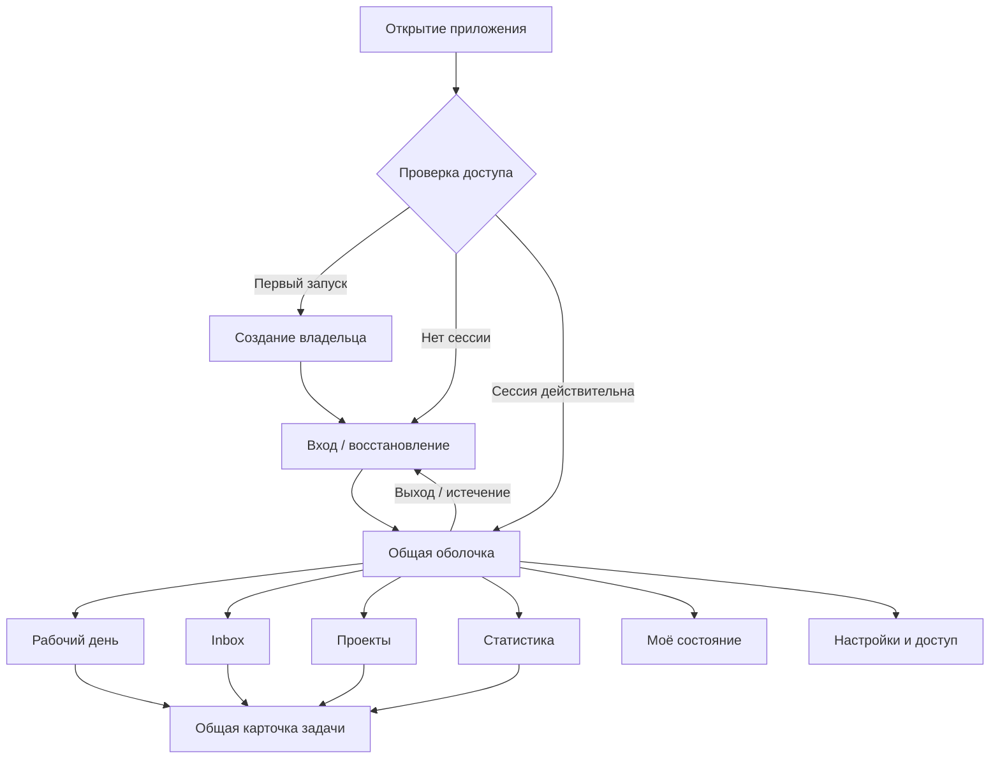
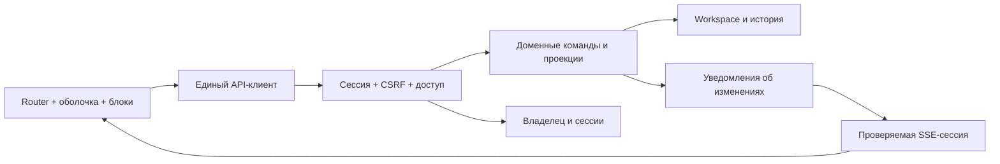

# Архитектура единого интерфейса Personal Spotter

Дата: 1 октября 2026 года. Версия: 1. Статус: проект архитектуры для согласования. Только документация; реализация, настройка доступа и миграция не выполнялись.

## 1. Область и исходное состояние

Документ объединяет [каркас проекта](project-spec.md), [модель данных](data-model-spec.md) и спецификации блоков в одно приложение: вход → рабочее пространство → работа с данными → завершение сессии. Здесь определены оболочка, маршруты, доступ, общие состояния и сквозные сценарии. Бизнес-правила задач и формулы остаются в профильных спецификациях; решения R1–R13 не переутверждаются.

Текущее состояние проверено по [серверу](../internal/server/server.go), [workspace HTTP](../internal/server/workspace.go) и [README](../README.md): локальный Go-сервер, статический web-интерфейс, API и SSE. Пользовательских учётных записей и сессий нет. `localOnly` проверяет непустой RemoteAddr и отсутствие X-Forwarded-For, но не удостоверяет пользователя и не проверяет принадлежность IP loopback. Заголовок X-Spotter-Request и проверка Origin для workspace-записи не являются входом в систему. Ограничение слушателя 127.0.0.1 — отдельная граница развёртывания.

Предлагаемый базовый профиль: один локальный владелец, одно workspace, обязательный вход для чтения и изменения личных данных. Это продолжает однопользовательскую модель проекта. Командная работа, публичная регистрация и облачный аккаунт не входят в базовый профиль. Выбор профиля и способа входа отмечен U1–U2 как proposal.

Официальное название в интерфейсе — **Personal Spotter**. Слоган — **Spotter - личное рабочее пространство.** Название и слоган используются согласно [правилам продукта](project-spec.md#название-и-слоган).

## 2. Информационная архитектура

Карточка — шестое представление общей модели, но не шестой пункт основного меню. Она открывается из контекста задачи и имеет прямую ссылку. Настройки — отдельный служебный раздел, вход — самостоятельная публичная оболочка без личных данных.

| Область | Состав и ответственность |
|---|---|
| Публичная оболочка | Логотип, вход, первоначальная настройка, восстановление, нейтральная ошибка связи. Без счётчиков задач, названий проектов и состояния здоровья |
| Общая верхняя панель | Personal Spotter, пять основных разделов, создание задачи, компактный статус синхронизации, меню владельца |
| Рабочая область | Заголовок раздела, его дата/период и локальные фильтры, содержимое, локальные ошибки |
| Общий редактор | Одна карточка задачи, изолированный черновик, единые сохранение/отмена/конфликт |
| Постоянная панель фокуса | Текущая задача и таймер между разделами; переход к задаче и действия по правилам рабочего дня |
| Служебная область | Настройки рабочего времени и пояса, источников, ориентиров, учётной записи и сессий |
| Общая обратная связь | Статус сохранения, конфликт, потеря соединения, повторный вход; предупреждения не заменяются исчезающими уведомлениями |

Десктоп сохраняет верхнюю навигацию существующих макетов. На узком экране она сворачивается в доступное меню с теми же разделами; дата и действия относятся к открытому экрану. Карточка становится полноэкранным диалогом. Постоянная панель фокуса не перекрывает кнопки сохранения и экранную клавиатуру.

## 3. Маршруты и переходы

Ниже целевые UI-маршруты, не существующие HTTP-обработчики. Технический router может быть выбран позже; прямое открытие и перезагрузка каждого адреса обязательны.

| Маршрут | Назначение | Доступ |
|---|---|---|
| `/` | Проверка сессии; затем рабочий день либо вход | Нейтральная точка входа |
| `/setup` | Однократное создание владельца с локальным подтверждением | Только до инициализации |
| `/login` | Вход, причина повторного входа, ссылка восстановления | Без сессии |
| `/recover` | Инструкция локального восстановления | Без раскрытия данных |
| `/app/day?date=YYYY-MM-DD` | [Рабочий день](workday-spec.md) | Владелец |
| `/app/inbox` | [Inbox](inbox-spec.md), категории и фильтры | Владелец |
| `/app/projects?project=ID` | [Проекты](projects-spec.md), выбранная ветка | Владелец |
| `/app/statistics?month=YYYY-MM` | [Статистика](statistics-spec.md) | Владелец |
| `/app/wellbeing?date=YYYY-MM-DD` | [Моё состояние](wellbeing-spec.md) | Владелец |
| `/app/tasks/ID` | [Карточка](task-card-spec.md) при прямом открытии | Владелец |
| `/app/settings/workspace` | Рабочее время, пояс, настройки планирования | Владелец |
| `/app/settings/sources` | Источники и диагностика разрешений | Владелец |
| `/app/settings/account` | Смена пароля, текущая сессия, выход со всех устройств | Владелец |

При открытии карточки поверх раздела URL получает `task=ID`, базовый маршрут сохраняется. Назад закрывает карточку и восстанавливает фильтры/прокрутку. Прямая ссылка `/app/tasks/ID` показывает ту же карточку в оболочке с явным переходом в Inbox. В URL допустимы ID, даты и фильтры, но не тексты дневника, пароли и токены.

Дата рабочего дня, дата дневника и месяц отчёта — отдельные контексты. Переход «Посмотреть этот день» передаёт дату явно; обычная смена раздела не переписывает чужой период. Значение по умолчанию — сегодня в поясе workspace. Исторические снимки остаются снимками; открытая из них карточка помечается как актуальная задача, её изменение не переписывает снимок.

Неверный формат параметра даёт понятную ошибку и переход к допустимому экрану. Неизвестная сущность после входа — «Не найдена»; до входа её существование не раскрывается. `returnTo` допускает только известные внутренние маршруты, внешние URL и схемы отвергаются.

## 4. Вход и первоначальная настройка

Термин «авторизация» включает два разных шага: аутентификация устанавливает владельца, проверка доступа разрешает ему конкретные операции. Скрытие элементов меню не заменяет серверную проверку.

Предложение U2: локальный пароль владельца, без обязательного email и внешнего провайдера. Экран входа содержит поле пароля, показать/скрыть, кнопку «Войти», состояние отправки, общую ошибку и ссылку «Восстановить доступ». Разрешены вставка и менеджеры паролей. Нет фиктивных кнопок Google/Apple или обещания письма восстановления.

Первый запуск:

1. Сервер не выдаёт личные данные до создания владельца, включая существующий workspace после обновления приложения.
2. Владелец запускает локальную процедуру и получает одноразовый setup-код. Он вводится в форме, не передаётся в URL и не записывается в обычные логи.
3. Форма задаёт пароль с подтверждением и поясняет локальность аккаунта. Создание учётной записи и привязка существующего workspace выполняются атомарно, без создания пустой замены.
4. Setup-код погашается. При двух запросах только один создаёт владельца. После инициализации повторный setup запрещён, включая после перезапуска.
5. Пользователь входит и проходит необязательную настройку пояса/источников. Отказ в Automation не блокирует ручные задачи. Настройки уже существующего workspace сохраняются.

Восстановление U3: локальная административная процедура под macOS-пользователем, владеющим хранилищем. Она выдаёт краткоживущий одноразовый код, позволяет задать новый пароль, отзывает все сессии и сохраняет задачи/историю. Точные команды будут определены при проектировании реализации. Общедоступный HTTP-запрос не может запускать сброс. Наличие локального файлового доступа администратора находится вне защиты веб-паролем; пароль входа сам по себе не шифрует файлы данных и резервные копии.

## 5. Сессия и модель доступа

| Состояние | UI | Сервер |
|---|---|---|
| checking | Нейтральная загрузка без старых данных | Проверяет сессию |
| setup_required | Первичная настройка | Закрывает личные API |
| anonymous | Вход/восстановление | Личные запросы получают 401 |
| authenticated | Полная оболочка | Проверяет владельца и доступ к workspace |
| expired / revoked | Закрывает личное содержимое, предлагает вход | Отказывает новым запросам, закрывает SSE |
| unavailable | «Не удалось проверить доступ», повтор | Недоступность сервера не считается неверным паролем |

Предложение U4: сессия в серверном хранилище, непрозрачный случайный токен в HttpOnly cookie; смена идентичности создаёт новый токен. Токены не хранятся в localStorage. Предлагаемые сроки: 30 минут без пользовательской активности и максимум 12 часов после входа; фоновые SSE/опросы не продлевают idle timeout. Сроки являются продуктовым выбором, серверная проверка обязательна независимо от браузерного таймера.

Владелец читает и изменяет свой единственный workspace, экспортирует ICS, обновляет источники и управляет своей учётной записью. Анонимный клиент получает только ресурсы входа и минимальный статус доступности. Планировщик/сборщики действуют как внутренний system actor, не через пользовательскую сессию. Подключение источника имеет собственные разрешения macOS; вход в Personal Spotter их не выдаёт. iPhone bridge сохраняет отдельный протокол доверия и не получает автоматически сессию владельца.

Будущие роли, приглашения и несколько workspace потребуют отдельной модели membership и серверной изоляции каждой сущности. Поле completionActor («выполнил я/другой») из доменной модели не становится ролью или аккаунтом. Для новых операций authenticated userId сохраняется отдельно от completionActor; старые local_user остаются историческим обозначением без выдуманной идентичности.

### Завершение доступа

- Явный выход отзывает серверную сессию, удаляет cookie, закрывает поток, очищает клиентские проекции и черновики. При несохранённом редакторе до выхода предлагаются «Остаться» или «Выйти и удалить черновик».
- При потере сети UI сразу скрывает данные, но сообщает, что серверный выход ещё не подтверждён; повторяет отзыв при восстановлении связи. Нельзя заявлять успешный отзыв только по очистке экрана.
- Истечение сессии скрывает редактор; U5 предлагает удержать черновик только в памяти той же вкладки. После входа того же владельца он восстанавливается и проверяет исходную версию. Перезагрузка удаляет такой черновик. Постоянное хранение личных черновиков в браузере по умолчанию не предусмотрено.
- Выход в одной вкладке блокирует остальные вкладки той же сессии. Межвкладочное уведомление ускоряет очистку; серверный отзыв остаётся обязательным. При возвращении из back/forward cache сначала повторно проверяется сессия, личный экран до проверки скрыт.
- Смена пароля требует текущего пароля и отзывает все прежние сессии; восстановление также отзывает все сессии. Управление сессиями не завершает задачу и не закрывает дневной план.
- Предложение U6: при утрате последней действительной сессии активный рабочий интервал завершается на последней подтверждённой активности, таймер требует сверки после входа; отсутствие пользователя не записывается как подтверждённый труд. Выход из одной сессии при другой активной не останавливает общий таймер. Это расширение контракта учёта времени требует отдельного решения.

## 6. Технические границы

Оболочка владеет сессией, навигацией, общей карточкой и панелью фокуса. Блоки владеют только своими фильтрами и отображением. API-клиент централизует 401/403/409, повторные чтения и отмену устаревших запросов. Общий store хранит серверные проекции по workspaceRevision; черновик редактора отделён от них. Стек Go/HTML/CSS/JS может сохраняться: новая архитектура сама по себе не требует фреймворка, микросервисов или замены хранилища.

SSE сообщает revision и изменившиеся домены; клиент перечитывает необходимые проекции. Разрыв потока не означает выход. При восстановлении проверяется сессия и актуальный снимок. Старый ответ не может перезаписать новую revision или экран другой даты. После logout ответы незавершённых запросов игнорируются по поколению сессии. Команды с неизвестным исходом повторяются только с тем же operationId; после повторного входа сначала проверяется результат и версия, автоматическое повторение произвольной записи запрещено.

### Логический контракт доступа

Имена следующих endpoint — предлагаемое расширение [спецификации API](api-spec.md) в её пространстве `/api/v2`, а не обещание готового транспорта. В API пока нет контракта входа; перед реализацией необходимо согласовать это расширение, коды 401/429 и защиту всех `/api/v2`-маршрутов, включая capabilities. AuthSession в этом документе и WorkSession/sessionId таймера в API — разные сущности.

| Метод и путь | Контракт |
|---|---|
| `GET /api/auth/session` | Минимальное состояние доступа; для владельца userId, workspaceId, permissions, сроки сессии и CSRF-контекст. Без личных данных для анонимного |
| `POST /api/auth/setup` | Одноразовый код и пароль; атомарное создание владельца |
| `POST /api/auth/login` | Пароль → новая cookie-сессия; ограничение попыток |
| `POST /api/auth/logout` | Отзыв текущей сессии; повтор безопасен |
| `POST /api/auth/logout-all` | Отзыв всех сессий владельца |
| `POST /api/auth/password` | Текущий и новый пароль; отзыв старых сессий |
| `POST /api/auth/recover` | Проверка локально выданного одноразового кода, новый пароль, отзыв сессий |

Логические записи: Owner(id, credentialHash, credentialVersion, createdAt); WorkspaceOwner(workspaceId, ownerId); Session(tokenHash, ownerId, createdAt, lastActivityAt, expiresAt, revokedAt); одноразовое подтверждение с назначением, сроком и фактом погашения. Секреты отделены от доменного экспорта; обычное восстановление backup не должно оживлять старые сессии. Удаление/повреждение auth-хранилища при существующем workspace не включает открытый setup: требуется локальное восстановление владельца.

Все пути чтения и записи защищаются сервером, в том числе нынешние `/api/state`, `/api/workspace`, `/api/refresh`, `/api/focus.ics` и `/events`. Защита `/app/*` без защиты этих путей недостаточна. Статические JS/CSS могут быть публичны, но не содержат встроенных личных данных. Неавторизованный API возвращает JSON 401, а не HTML формы входа; 403 означает запрет при известной сессии/ошибку защиты запроса, 409 — конфликт версии, 429 — превышение попыток. Ошибка проверки сессии 5xx не сбрасывает пароль и не открывает доступ.

SSE проверяет сессию при подключении и в течение соединения: отзыв/истечение прекращает передачу, включая открытые соединения. Для EventSource, где причина ошибки недоступна клиенту, повторная проверка `/api/v2/auth/session` различает истечение и сетевой сбой. Токен сессии в URL потока не допускается.

### Защита транспорта и секретов

Для HTTPS-профиля: cookie Secure, HttpOnly, SameSite, ограниченная область; серверные сроки и отзыв. Рекомендации по сессиям сверены с [OWASP Session Management](https://cheatsheetseries.owasp.org/cheatsheets/Session_Management_Cheat_Sheet.html). Конкретные значения сроков выше — предложение Personal Spotter, не предписание источника.

Пароль хранится как salted hash; предлагается Argon2id с параметрами, выбранными по замеру на целевой машине и актуальным минимальным требованиям [OWASP Password Storage](https://cheatsheetseries.owasp.org/cheatsheets/Password_Storage_Cheat_Sheet.html). Пароль, setup/recovery-коды и cookie не попадают в логи и модельные запросы. Попытки входа/восстановления ограничиваются сервером с задержкой и понятным временем повтора, без бессрочной блокировки владельца; параметры входят в профиль U4.

Все изменяющие запросы, включая refresh и операции аккаунта, имеют проверку допустимого Origin и CSRF-защиту. Для login/setup/recover применяется отдельный предварительный CSRF-контекст; существующий X-Spotter-Request не является удостоверением личности. Допустимые Host и Origin задаются конфигурацией, не выводятся только из присланного Host. CORS для произвольных источников не открывается. Личные ответы и auth-ответы — no-store; service worker не кэширует их.

U7: базовый локальный HTTP допустим только как явно выбранный loopback-профиль с проверкой адреса слушателя, Host/Origin и ограничений cookie в поддерживаемых браузерах. Cookie не изолируются портом: другие приложения на том же host входят в модель угроз. Этот профиль не обещает защиту от вредоносных процессов того же macOS-пользователя. Для доступа по сети обязателен отдельный HTTPS-профиль с согласованным origin и доверенными proxy; простое изменение host на 0.0.0.0 не считается включением удалённого режима. До выбора и проверки профиля авторизация не считается готовой к выпуску.

## 7. Общие UX-контракты

| Ситуация | Единое поведение |
|---|---|
| Загрузка | Каркас раздела, без ложных нулей и краткого показа предыдущих личных данных |
| Пусто | Известное отсутствие данных и доступное следующее действие |
| Источник недоступен | Причина и время последнего успеха, ручная работа остаётся доступной |
| Сохранение | Блокировка повторной отправки конкретной команды, успех только после подтверждения |
| Конфликт | Черновик сохранён, сравнение с актуальными данными и явное повторное применение |
| Нет сети | Пометка устаревших данных в действующей сессии, запись не считается сохранённой; очередь офлайн-команд не обещается |
| Переход с черновиком | Сохранить, отказаться или остаться; ошибочное сохранение не продолжает переход |
| Ошибка раздела | Локальная ошибка и повтор; остальные разделы доступны при действующей сессии |
| Ограниченная история | partial/unavailable/provisional и пояснение, а не нули |

Кнопка «Создать задачу» использует общую карточку. Создание из проекта предзаполняет projectId; глобальное создание оставляет проект необязательным. Быстрое действие не обходит серверные ограничения домена. Уведомления об источниках/сохранении не образуют новую систему писем или push.

Клавиатура: последовательный Tab, видимый фокус, доступные подписи, Escape закрывает диалог только через защиту черновика; после закрытия фокус возвращается к инициатору. Ошибки связаны с полями, состояние не передаётся одним цветом. На 320 px доступны все действия, длинные названия и увеличенный текст; таблицы имеют локальную прокрутку, а не горизонтальную прокрутку всего приложения. Вход поддерживает клавиатуру и менеджер паролей наравне с остальным приложением.

## 8. Решения для согласования

Все строки — proposal. Документ завершает архитектурную проработку, но не подменяет выбор пользователя. При смене U1 на многопользовательский продукт необходимо пересмотреть модель данных до реализации.

| ID | Предложение | Что зависит от выбора |
|---|---|---|
| U1 | Один локальный владелец и одно workspace | Изоляция данных, отсутствие регистрации/ролей команды |
| U2 | Локальный пароль; внешние провайдеры/passkeys отдельным этапом | Формы входа, credentials, первоначальная настройка |
| U3 | Восстановление только с локальным подтверждением владельца ОС | Recovery UX и административная процедура |
| U4 | Серверная cookie-сессия; idle 30 минут, absolute 12 часов; без «запомнить навсегда» | Сроки, rate limits и профиль защиты до реализации |
| U5 | Черновик при истечении только в памяти, при явном выходе удаляется | Удобство восстановления против остаточных данных вкладки |
| U6 | Утрата последней сессии останавливает подтверждённый учёт и требует сверки | Согласование с контрактом WorkSession/TimerState |
| U7 | Loopback по умолчанию, сетевой HTTPS отдельным режимом | Cookie, origin, deployment и тестовая матрица браузеров |

## 9. Критерии будущей сквозной приёмки

1. Первый запуск без владельца и обновление с существующим workspace: данные закрыты, setup не теряет задачи; гонка setup не создаёт двух владельцев.
2. До входа прямые ссылки, API, ICS и SSE не раскрывают данные. Проверены все старые маршруты, а не только новое меню.
3. Вход возвращает к допустимой внутренней ссылке; внешний returnTo отвергается. Неверный пароль, 429 и ошибка сервера различимы.
4. Одна задача создаётся в проекте, разбирается в Inbox, планируется, редактируется общей карточкой и отражается в статистике без дублирования ID.
5. Назад/вперёд, прямая ссылка, обновление страницы, выбор даты и смена раздела сохраняют явный контекст, не переписывают снимки.
6. Конфликт двух вкладок и потеря ответа не теряют черновик и не повторяют завершение/комментарий; ответ старой сессии не возвращает данные после выхода.
7. Истечение, logout, logout-all, смена и восстановление пароля блокируют API и уже открытый SSE. Сеть при logout не даёт ложного сообщения об отзыве.
8. После входа того же владельца черновик восстанавливается только в пределах U5 и повторно проверяет версию. Назад после logout не раскрывает личный экран.
9. Таймер переживает навигацию; истечение/отзыв, сон компьютера и несколько сессий не создают фиктивного времени по выбранной U6.
10. Ошибка Calendar или отсутствие разрешений не выдаются за ошибку входа и не мешают ручным задачам.
11. Проверены клавиатура, менеджер паролей, 320 px, длинные тексты, сетевые ошибки и отсутствие измерений.
12. Повтор восстановления, истёкший setup/recovery-код, повреждение auth-хранилища и восстановление backup не открывают доступ и не оживляют старые сессии.

## 10. Порядок дальнейшей подготовки

Сначала согласовать U1–U7; затем увязать сущности доступа с моделью данных и выпустить точный API-контракт: payload, коды ошибок, validation/rate-limit policy, CSRF и сроки одноразовых подтверждений. Появившаяся во время подготовки [спецификация API](api-spec.md) задаёт доменный транспорт `/api/v2`; её необходимо дополнить контрактом доступа из раздела 6. Настоящий документ не заменяет доменный API и его протокол heartbeat/сверки таймера.

Следующий документальный артефакт — согласованный сквозной макет «первый запуск → вход → рабочий день → карточка → настройки → выход» с состояниями истечения и восстановления. Существующие раздельные макеты остаются источником требований к блокам. Реализация начинается после завершения соответствующих решений и контрактов; перечисленные сценарии приёмки ещё не выполнялись на работающем приложении.

Календарь 2.1.0: отдельный маршрут /calendar между /inbox и /planning, заголовок окна «spotter - Календарь». На узком экране день и форма идут под месяцем; на широком — рядом. Используются общая карточка и полные пути задач через слеш.
